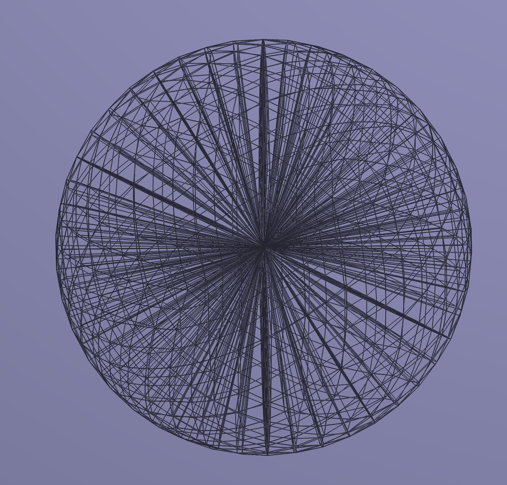
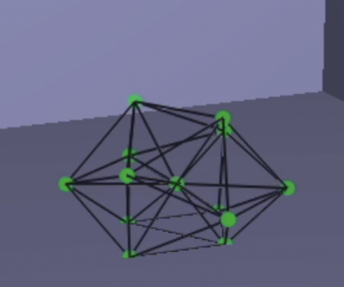
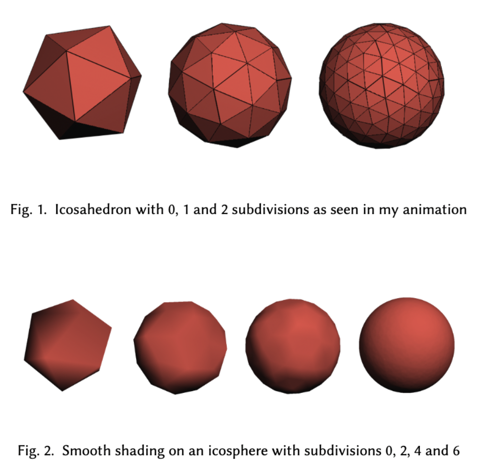
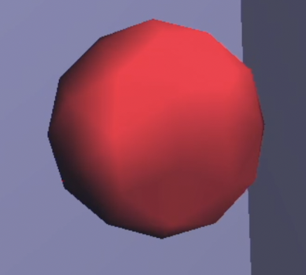

# Squishy

Welcome to my first squishy ball physics simulation using Java! See [particlesystem.java](src/comp559/particle/ParticleSystem.java) for the icosahedron formula. Run configurations are set for intelliJ.
* Check out the [report](report.pdf) and [video demonstration](https://www.youtube.com/watch?v=-ZCJqIITaxQ)!

 
 
 
 

## The GUI
* Click and scroll to zoom in.
* Starts with an icosahedron, can subdivide it a few times before it crashes.
* Decrease spring damping for more jiggly ball.
* Keyboard commands:
  * 1: forward euler (not recomended)
  * 2: symplectic euler
  * 3: midpoint
  * 4: modified midpoint
  * 5: rk4
  * 6: backward euler
  * space: run
  * R: restart
